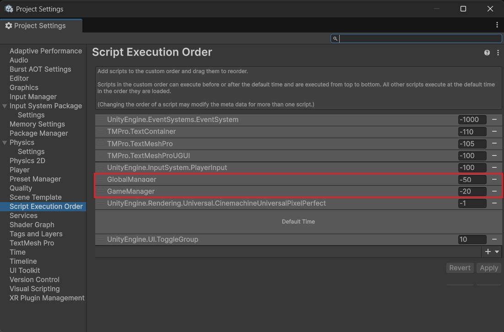
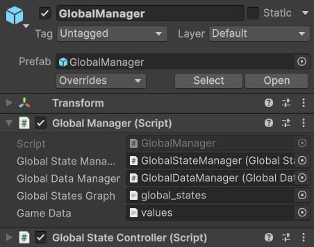
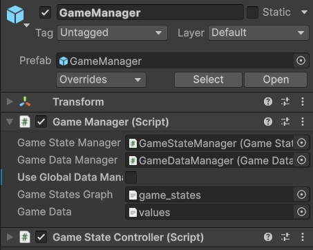
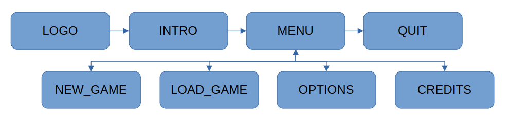

UNITY STATE ENGINE
==================

# Introduction

State machine implementing a state transition graph to use for a classic game scenes structure.

(add more infos)

Only state and data management system, no game is provided.

Built for Unity 6.


# Usage

To use the "State Graph Engine", a number of steps are required, which can be grouped in the following categories:
* Setup the Unity project
* Design the state graphs
* Define the game data
* Build the graph manager prefabs
* Create the state scenes
* Prepare(?) the game levels
(TODO: ADD LINKS TO EACH SECTION)

(TODO: REWRITE)
Samples are provided with the engine(TODO: LINK SAMPLES), allowing to use the engine straight away, either for testing/exploring, or to use as a base for a new game.


# Project Setup

First part consist in making the Unity project ready to use the engine.

* Download the latest release (or clone the repository for latest changes).

* Extract the downloaded repository to a temporary directory.

* Create a new Unity project.\
	Any type of project can be created depending on the desired game type. The state engine is independent of the project type.

* Copy the `StateEngine` directory from the extracted repository to the project's `Assets` folder.\
	**TODO:** Not everything needs to be copied - see minimal that can be used (remove XML files, prefabs, tests, etc.)
		+ clean useless/obsolete files!

* Set scripts execution order.\
	Some scripts need to be executed early at the start of the application for proper initializations.
	This can be managed by changing the script execution order:
	* Go to `Project Settings` -> `Script Execution Order`
	* Add `GlobalManager` before `Default Time`
	* Add `GameManager` before `Default Time` (just after `GlobalManager`)

	


# State Graphs

The state engine manages state transitions based on **graphs**.

Graphs are composed of **states** and **transitions** between these states.

The graphs are managed by **graph managers**(TODO: LINK GRAPH MANAGERS).


## Graphs

A game project ideally contains manage 2 graphs:
* Global Graph: Starting point of the application, allowing to start play sessions.
* Game Graph: The game itself, handling a play session.

> **NOTE:** It is possible to have only a game graph.
This however requires a specific initialization, which would normally be made by the global graph (TODO: LINK to section with 'initGame')

Graphs are defined in XML files.
They can be created manually or by using the [graph generation tool](TODO: LINK PROJECT)


### Global Graph

Graph used at the global level, when launching the application.

The global graph manages the high-level structure of the game.
It serves as the starting point for the application, and manages the starting of play sessions.

In order to have a working game, the handling of essential *actions* (TODO: LINK STATE CONTROLLER) is required in a global graph:
* `NewGame`: Start a new game.
* `Quit`: Leave the application.

Additionally, other common global *actions* include:
* `LoadGame`: Load a previously saved game.
* `Continue`: Continue the current game.

All the *actions* can be handled in a single state, or can be handled independently in different states.
Typically, a global graph will have a main state (presenting a main menu), with transitions to other states, each handling a specific *action*.

A global graph can also contain other states with specific roles, including:
* Studio logo screen
* Introduction video sequence
* Game settings screen
* Game credits
* etc.


### Game Graph

Graph used at the game level, when starting or loading a play session.

The graph manages the game itself, coordinating the game levels.

A game graph must have a special "level" state, which will hold the playable elements of the game (TODO: LINK LEVEL STATE).

A state that is common to many games is a "map" state, presenting a level selection screen or a view of the game world.

Other states can be:
- TODO: (examples: begin anim, briefing, etc)

As for the global graph, handling essential *actions* is required in a game graph:
* `StartLevel`: Start a new level.
* `EndLevel`: Finish the current level (with success or failure).
* `CheckGameComplete`: Determine if the game is over by reaching its end objective.
* `CheckGameOver`: Determine if the game is over after failing all available attempts.
* `CheckContinue`: Determine if the game can be resumed from a previous state after all attempts have failed.
* `UseContinue`: Resume the game from a previous state.
* `QuitGame`: Leave the game.

Additionally, other common global *actions* include:
* `QuitLevel`: Leave the current level.
* `SaveGame`: Save the game in its current state.

The `EndLevel` and `QuitLevel` *actions* must be handled in the "level" state directly.\
All the other *actions* except `StartLevel` can be handled in the "level" state, or handled independently in different states.

Actions are described in more details in ...(TODO: LINK STATE CONTROLLER).


## States

A state corresponds to a Unity scene, which gets loaded when transitionning to that state.

States are defined by a `<state>` node, taking a set of attributes:
* `id`: A unique identifier for the state, which can be used to reference the state in other states.\
	This id is also used internally by the engine.
* `scene`: The name of the scene corresponding to the state (name without extension).\
	Scene names must be unique in order to avoid ambiguity and potential issues. A scene can however be shared between several states.
* `restartable`(*): A boolean specifying if when coming back from a child state (**TODO:** see transitions), the state is restarted instead of transitionning to its "next" state.\
	By default, a state is not restartbale, in which case the attribute can be omitted.
* `next`(*): The `id` of the "next" state in the graph execution.\
	When a state has finished its execution, an automatic transition can be triggered to this other state.\
	The attribute can be omitted, in which case the "next" transition will switch to the parent state.
* `leavable`(*): A boolean specifying if the engine can exit the current graph from this state.\
	By default, a state is not leavable, in which case the attribute can be omitted.\
	**NOTE:** Nothing prevents the aplication from leaving the graph from any state, but this allows some control from within the graph execution.

(*): More information about these attributes is provided in "transitions" (TODO: LINK TRANSITIONS)

Here is an example of a game state definition:
```xml
<state id="MAP" scene="Map" restartable="true" leavable="true" next="LEVEL">
```


### Level State

A game graph should contain a level state, else it wouldn't really be a game.

The level state will generally be shared between all game levels, and for that it doesn't have a single corresponding scene as for the other states.

For this reason, the level state in a game graph has a specific attribute: `isLevel`:
```xml
<state id="LEVEL" isLevel="true" />
```
When the graph manager finds a state with this attribute set, it ignores the state's `scene` attribute (which can thus be ignored for that state).

Scenes associated to the levels are defined in the "level tree" (TODO: LINK LEVEL TREE).

A game graph can have more than one level state in specific cases, but in general one is enough.
(TODO: show different graph examples with several level states...?)


## Transitions

Graphs generally have a starting state, but this is not mandatory: a game graph can for example start from a different state when beginning a new game or when continuing a previously saved game.\
The first state found in the graph definition will be considered as the initial one, but a graph execution can be started from any state by loading its corresponding scene first.

When a state finishes its execution, it can trigger a transition through the graph manager to switch to another state.

Different types of transitions are managed, depending on how they've been defined:
* *next* transition
* *child* transition
* *leave* transition

Transitions are triggered using *actions*, which correspond to calling specific methods in the graph manager.\
*actions* are defined in state controllers(TODO: LINK STATE CONTROLLER).


### Next

A transition to the *next* state occurs when a state has finished its execution, and is triggered automatically by the graph manager.

As seen in the state's definition (**TODO** link?), a *next* transition is defined using the `next` attribute.

An example of a state with a *next* transition is as follows:
```xml
<state id="LOGO" scene="Logo" next="INTRO">
```

If no *next* state is specified, an implicit transition to the *parent* state is triggered when the state's executionn has ended (if there is no *parent* state, the application quits).
(**TODO:** mention here? "to trigger the transition, call `End`")

A *parent* state is a state for which a list of *child* transitions are defined.


### Child

In some cases, it is desired after a state's execution to come back to a previous state.

*child* transitions allow the graph manager to automatically switch back to their *parent* state once their execution has ended.
If the *parent* state's `restartable` attribute is set, it executes itself again, else a transition to its *next* state is triggered.

*child* transitions are defined by adding a `<children>` node inside the state's `<state>` node, containing a `<child>` node for each transition.

An example of a state with *child* nodes is as follows:
```xml
<state id="MENU" scene="Menu" next="QUIT">
	<children>
		<child id="NEW_GAME"/>
		<child id="OPTIONS"/>
	</children>
</state>
```

(**TODO:** mention here? "to trigger a child transition, call `LoadChildState(<STATE_NAME>)`")


### Leave

To exit a graph, one can simply load another scene.\
However, this is not advised, as it would not properly stop the graph manager and could create unexpected behavior.

To properly leave a graph, a specific command must be used (TODO: LINK), which will make sure everything is cleaned before leaving.

To add a bit of control, it is not allowed to leave the graph from any state: a state must have its `leavable` attribute set to allow the transition outside of the graph.

(**TODO:** mention here? "to trigger the transition, call `Leave` with the target scene name as parameter, or nothing to leave the application")


# Data

The engine provides management of data to be used by the application.
Global data and game data can be defined, and will be available for use from within the associated graph.

Global data generally comprises the main game settings, and game data represents the ingame values, such as the number of lives, points, etc.


## Definition

For the game data, game specific data fields can to be defined in an XML file.

> **NOTE:** Currently an XML file is only handled for game data and not global data. Global data can still be defined and used in code, but is not managed automatically as the game data.

The XML file must follow a specific structure, defining common fields as well as fields associated to a specific difficulty level (TODO: LINK DIFFICULTY).


### Difficulty Levels

A common feature in games is the ability to choose between difficulty levels.

The engine allows to define as many difficulty levels as desired (at least 1).

A difficulty level is defined in the XML file by adding a `<difficulty>` node, defining the data associated to that difficulty level.
Generally each difficulty node will contain the same fields, holding different values.

For data fields that don't depend on the difficulty level, a `<common>` block can be used.
TODO: OK if no 'common' block? => Change code if needed!
(write about it...)

### Lives & Continues

TODO: rewrite
Almost any game can be said to at least have common basics:
- levels, which can be won or lost (success or failure)
- lives, specifying the number of attempts to complete a goal or a level
- continues, specifying the number of times the player can resume the game after having lost all their lives or failing an objective, instead of being forced to start completely over.

The state engine automatically handles these essential game elements, and game fields are already defined and managed for the number of lives and continues.

When a player fails an objective (to be defined by the game), they lose a life.\
When all lives are lost, a continue can be used to retry (resetting the number of lives).\
When all continues have been used, the game is over.

The number of lives and continues are associated to difficulty levels, and can be added as direct attributes of the `<difficulty>` nodes, named respectively `lives` and `continues`:
```xml
<difficulty lives="5" continues="2" />
```
They can also be defined as the other game data fields(TODO: LINK GAME FIELDS), using the "LIVES" and "CONTINUES" identifiers.

The 2 fields can also be omitted, and default values will be used (1 life, 0 continues).


### Game Fields

Lives and continues can be enough for some games, but generally more data is needed (common ones such as health, points, etc.).

Additional game specific data fields can be defined and used where needed in the engine.

To add game data fields to the XML file, the `<field>` node is used.
It can be added in the `<common>` node or in the `<difficulty>` nodes.

Here is an example of a basic game data file adding data for health and points management:
```xml
<?xml version="1.0" encoding="utf-8"?>
<values>
    <common>
        <field name="POINTS" value="0" />
    </common>
    <difficulty lives="5" continues="2">
        <field name="HEALTH" value="100" />
    </difficulty>
    <difficulty lives="3" continues="1">
        <field name="HEALTH" value="50" />
    </difficulty>
    <difficulty lives="1" continues="0">
        <field name="HEALTH" value="25" />
    </difficulty>
</values>
```

Depending on which difficulty level is set when starting the game, the player will have different numbers of lives and continues.\
The starting health value also varies depending on the difficulty level, whereas points starting value is the same for all difficulties.


(TODO: MOVE/REMOVE - to GRAPH MANAGERS?)
This file is provided as default in `Resources/Xml/values.xml`.
A custom file can be used instead, by setting it for the "Game Data" property in both `GlobalManager` and `GameManager` prefabs.


## Usage

Data fields are handled by session manager scripts, providing ways to load and save the fields persistent values. Persistent values are kept between states.

The data fields can then be managed by data managers, controlling when to modify or restore the fields values.
This requires data manager scripts to be created. Base abstract classes are provided for global and game data respectively.

These managers are controlled be the graph managers.

To summarize:
* Graph managers handle session and data managers.
* Session managers manage data persistent values.
* Data managers manage data current values, via orverridden scripts.


### Game Data

To manage the game data fields from within the engine, a game data manager script must be created, named for example `GameDataManager`.

The script should be an implementation of the `IGameDataManager` abstract class (defined in the script with the same name), overriding its abstract methods:
* `LoadSpecifics`
* `CommitChangesSpecifics`
* `ResetLifeData`
* `ResetContinueData`

Then, for each game data field defined in the XML file:
* Declare the game field as a public property:
	```csharp
	public int points { get; set; } = 0;
	```
	The field current value can then be managed through the property from anywhere via the data manager using:
	```csharp
	GetGameData().points
	```
* Load its persisted value in `LoadSpecifics`:
	```csharp
	points = gameSessionManager.GetField("POINTS");
	```
* Save its value in `CommitChangesSpecifics`:
	```csharp
	gameSessionManager.SetField("POINTS", points);
	```
	The fields set in this method will typically be saved between levels.
	If a field value doesn't need to be persisted between levels, it should not be added here.
* Load the initial value in `ResetLifeData` or `ResetContinueData` (or both), depending if the field is related to a life or a continue:
	```csharp
	points = gameSessionManager.GetInitialField("POINTS");;
	```
	`ResetLifeData` will be called when losing a life, and `ResetContinueData` will be called when using a continue.

To save the data fields current values and make them persistent for other states, the data manager `CommitChanges` method must be called.
It can be called from anywhere by getting access to the game data manager:
```csharp
GetGameData().CommitChanges();
```
For example, values should be saved when ending a level (when winning and/or losing).

If want to manage fields independently, the session manager methods can be called directly:
```csharp
int GameSessionManager.Instance.GetField(string name);
void GameSessionManager.Instance.SetField(string name, int value);
```

### Global Data

Similarly, to manage the global data fields from within the engine, a global data manager script must be created, named for example `GameDataManager`.

The script should be an implementation of the `IGlobalDataManager` abstract class (defined in the script with the same name), overriding its abstract methods:
* `LoadSpecifics`
* `CommitChangesSpecifics`

> **NOTE:** There is currently no handling of an XML file to define the global data fields.

Then, for each global data field:
* Declare the global field as a public property.
* Load its persisted value in `LoadSpecifics`.
* Save its value in `CommitChangesSpecifics`.


# Graph Managers

The main components of the state engine are the graph managers.
They manage the states and the transitions between them, as well as the data.

A graph manager game object needs to be present in every state scene(TODO: LINK SCENES):
* global state scenes must contain a global graph manager,
* game state scenes must contain a game graph manager.

(TODO: rewrite)
A graph manager game object is composed of:
* A `GlobalManager|GameManager` script component, with:
	* A `GlobalStateManager|GameStateManager` prefab.\
		This game object will be shared between all states as a unique instance.
	* A `GlobalDataManager|GameDataManager` prefab.
	* A `GlobalStateGraph|GameStateGraph` text asset.
	* A `GameData` text asset (*).
* A `GlobalStateControler|GameStateController` script component.\
	This component is specific to each state, and can be replaced by overridden script when desired (TODO: see below - link?).

Optionally, a game graph manager can contain and manage a global data manager, if access to the global data is needed.


[^1]: The XML file containing the game specific data fields definitions has to be attached to both graph managers through their `Game Data` property. The same file must be set for both managers.

Pre-built prefabs are provided for the graph managers to facilitate the setup, only requiring their properties to be set.
However, if desired, new ones can easily be built from scratch (and could be part of other game objects - even if this is not recommended).

Alternatively, fully set up prefabs are also provided in the samples(TODO: LINK SAMPLES - eg: GlobalManagerStarter).


## Global Manager

To build a global manager prefab from the pre-built prefab `GlobalManager`:

- Prerequisites: make sure to have: (see previous sections - TODO: add links?) (these can also be obtained from the provided samples)
	- A global data manager script implementing `IGlobalDataManager`, eg: `GlobalDataManager.cs`.
	- A global state graph XML file, eg: `global_states.xml`.
	- A game data XML file, eg: `values.xml`.[^1]
- create a `GlobalDataManager` prefab from the script with the same name
	- Either create an empty object and add a `GlobalDataManager` script component, or drag and drop the script in the hierarchy(...).
	- Save the prefab.
- create the global graph manager game object:
	- instantiate the `GlobalManager` prefab.
		Should already have a `GlobalStateManager` prefab set for its `Global State Manager` porperty, as well as a `GlobalStateController` script component attached to it.[^2]
	- set the `GlobalManager` prefab properties:
		- set the `GlobalDataManager` prefab for the `Global Data Manager` property
		- set the `global_states` XML file for the `Global States Graph` property
		- set the `values` XML file for the `Game Data` property
	- save the prefab (as a variant, or replacing the original).

[^1]: The global graph managers need to have access to the game data definitions, as some of it is required when starting or loading a game. No game data manager script is needed here though.

[^2]: The default `GlobalStateController` script is enough for basic states and common *actions*. However, if specific operations or *actions* are needed, the *state controller* (TODO: LINK ...STATE CONTROLLERS?) script component should be replaced by a new script overriding the class.




## Game Manager

To build a game manager prefab from the pre-built prefab `GameManager`:

- Prerequisites: make sure to have: (see previous sections - TODO: add links?) (these can also be obtained from the provided samples)
	- A game data manager script implementing `IGameDataManager`, eg: `GameDataManager.cs`.
	- Optionally a global data manager script implementing `IGloalDataManager`, eg: `GlobalDataManager.cs`.
	- A game state graph XML file, eg: `game_states.xml`.
	- A game data XML file, eg: `values.xml`.
- create a `GameDataManager` prefab from the script with the same name
	- Either create an empty object and add a `GameDataManager` script component, or drag and drop the script in the hierarchy(...).
	- Save the prefab.
- Optionally create a `GlobalDataManager` prefab from the script with the same name
	- Either create an empty object and add a `GlobalDataManager` script component, or drag and drop the script in the hierarchy(...).
	- Save the prefab.
- create the game graph manager game object:
	- instantiate the `GameManager` prefab.
		Should already have a `GameStateManager` prefab set for its `Game State Manager` porperty, as well as a `GameStateController` script component attached to it [^1].
	- set the `GameManager` prefab properties:
		- set the `GameDataManager` prefab for the `Game Data Manager` property
		- optionally check the `Use Global Data Manager` checkbox and set the `GlobalDataManager` prefab for the `Global Data Manager` property 
		- set the `game_states` XML file for the `Game States Graph` property
		- set the `values` XML file for the `Game Data` property
	- save the prefab (as a variant, or replacing the original).

[^1]: The default `GameStateController` script is enough for basic states and common *actions*. However, if specific operations or *actions* are needed, the *state controller* (TODO: LINK ...STATE CONTROLLERS?) script component should be replaced by a new script overriding the class.




# Scenes

Each state requires an associated scene, which must satisfy the following requirements:
* Scene name as defined in the corresponding state graph (`scene` attribute).
* Must contain a graph management object:
	* `GlobalManager` prefab for global states.
	* `GameManager` prefab for game states.
* The scene must be added in the project's scene list (in build profiles).

**NOTE:** The starting scene (first one in the project's build settings) must be the one associated to the state defined as entry point in the global state graph.

Additionally, depending on the state's attributes and transitions, certain *actions* (TODO: LINK STATE CONTROLLER) are expected to be executed following specific events.
...

TODO: process:
For each state:
* Create a new scene(*).
* Instantiate a graph management prefab(TODO: LINK GRAPH MANAGER), either global or game, depending on which graph the state belongs to.
* If needed, override and replace the state controller script in the graph manager for the specific state(TODO: LINK STATE CONTROLLER).

(*): A scene can be shared between several states.


## Graph Manager

TODO: need to instantiate graph manager prefab in each scene...
...

## State Controller & Actions

Define specific state *actions*(?) by overriding the state controller script.

For example, specific state initializations can be done in overridden `HandleMainState`.

Example of a game state override, using the player's number of lives:
```csharp
public class LevelState : GameStateController {
    protected int lives;

    public override void HandleMainState() {
        lives = GetGameData().GetLives();

        // other initializations...
    }

    // more state specific methods...

}
```

As seen previoulsy, transitions are triggered using *actions*.\
An *action* is a method defined in a state controller script, which can be called from within a state.

Basic transition *actions* are directly available in the default `StateController` script:
* `End`: Trigger transition to the *next* state.
* `LoadChildState`: Trigger transition to a *child* state.\
	The method takes a state name as parameter.\
	The specified state must be defined as a *child* state in the graph, else an error will be raised.
* `Leave`: Trigger transition to another scene, leaving the current graph.\
	The method takes a scene name as parameter.

More *actions* can be defined for specific operations(?) by overriding the state controller script.
Example scripts are provided defining most of the common *actions* and can be used directly (TODO: LINK TO 'examples'?).


(TODO: mention? where?
automatic transitions:
A "Timer" (script) can be added (global or not depending on graph) if want the state to be left after a period of time
)


### Global Graph Actions

...specific global states
handle main menu to start and load game sessions.
can also have game options, credits, etc.
(TODO: redundant...? -> should not repeat to many times)

TODO:...
specific global *actions*
... override `GlobalStateController` script and add specific methods:

* `NewGame`: Start a new play session.\
	Steps:
	* Create a new game session with a specified difficulty level.\
		Difficulty levels are defined in data values(TODO:LINK), starting from 0.\
		The difficulty level can be provided as an input integer parameter to the method.
	* Leave the graph (transitionning to a state in the game graph).
	```csharp
	public void StartGame(int difficulty) {
		GameSessionManager.Instance.NewGame(difficulty);
		Leave("<GAME_SCENE>");
	}
	```
	where `<GAME_SCENE>` is the name of the game state's scene to load(*).
* `LoadGame`: Load a previously saved game.\
	Steps:
	* Determine saved game to load.\
	The saved game identifier can be provided as parameter to the method.\
	TODO: currently handling filenames as string, but should be saved slot ids/numbers? (str|int?)\
	* Load a game session with the saved identifier.\
	* Leave the graph if the loading was successful (transitionning to a state in the game graph).
**TODO:** "+optional SetLevel, if skip Map state" => seems useless, already done when loading data (=> CHECK!)
	```csharp
	public void StartGame(string filename) {
		if(GameSessionManager.Instance.LoadGame(filename)) {
			Leave("<GAME_SCENE>");
		}
	}
	```
	where `<GAME_SCENE>` is the name of the game state's scene to load(*).
* `Quit`: Leave the graph and close the application.\
	No specific method is required for this *action*, as the `Leave` method can be called directly without parameter (no scene name).\
	(**TODO: CHECK!!!!
	Optionally, the current game session can be saved...:
	TODO2: NEED TO DETERMINE FILENAME! (could be in game data/fields?)
	```csharp
    public void Quit() {
        if (GameSessionManager.Instance.GetLevel() != -1) {
	        GameSessionManager.Instance.SaveGame(filename);
		}
        Leave();
    }
	```
	)
	TODO: be consistent with 'play session' and 'game session')
* `Continue`: Go back to the current or last loaded game session.\
	This can be done by directly calling the `Leave` method with the desired game state's scene name.\
	To make sure a game session is actually loaded, a check on the current level can be added (if no level is set, the game will start from the first level).
	```csharp
	public void Continue() {
		if (GameSessionManager.Instance.GetLevel() != -1) {
			Leave("<GAME_SCENE>");
		}
	}
	```
	where `<GAME_SCENE>` is the name of the game state's scene to load(*).

(*): TODO: here? "for scene names parameters, can add a `SceneProperty` property to the script, and get the scene name from its `name` attribute"

> **NOTE:** The states implementing these *actions* **must have their `leavable` attribute set**, to be allowed to leave the current global graph when calling `Leave`.


(TODO: here? title OK?
#### GLobal Actions in Game Graph
if no global graph, ...

!!!! TODO: to use GlobalDataManager in game graph, ... !!!!
(checkbox, set prefab, etc.)
+ explain purpose and usage...

REWRITE FROM:
- in game states
    - possibility to "load global" (to init the game data, loaded when coming from global graph)
        => allowing to test a game state/scene without to start from global graph.
(TODO: check if put details here or leave in file...)
        "InitGame" script in "Tests/Game" (see script for use details).
		(need to call NewGame or LoadGame)
)


### Game Graph Actions

...specific game states
must at least have a "level" state (TODO: LINK LEVEL) handling the gameplay(?).

Available game specific *actions*:

* `StartLevel`: Start a level.\
    Typically in a "map" state if exists.\
	Steps:
	* Set the current level by specifying its number.\
	* Trigger the transition, for example to a `child` state.
	```csharp
	public void StartLevel(int level) {
		GetGameData().SetLevel(level);
		LoadChildState("<GAME_STATE>");
	}
	```
	where `<GAME_SCENE>` is the name of the game state to transit to.

- Check Game Complete: In last state related to level in "success" branch (or default if no success/fail branches).
    => In "level", if transition 'WIN_STOP_TRANSITION_STATE' (auto generated)
    bool GetGameData().IsGameComplete()

- Check Game Over: In last state related to level in "fail" branch.
    bool GetGameData().IsGameOver()

- Check Continue: After "Check Game Over".
    bool GetGameData().CanContinue()

- Use Continue
    int GetGameData().LoseContinue()
        + do it here (+call CanContinue):
            gameData.SetLevel(-1)
            and in post level states, use 'latestLevel' to get the level (as current level is now '-1').

- Save
    GameSessionManager.Instance.SaveGame(str|int?)


TODO:...
...override `GameStateController` script and add methods for additional *action*.


# Levels

...
Mandatory state... (can have more than 1)
very specific,
required operations...
- 1 common script
- 1 scene per level (or not)
- defined in 'levels.xml'
(TODO: make subsections: "Level Graph"?, "Level Manager"?, "Level Scenes"...?)

## Level Tree / Level Graph?
TODO: explain level tree stuff (xml, level files, etc.)

## Level Scenes
TODO...

TODO: CHECK FOR LEVEL NAMES!
OLD?    ! - Except for the level scenes, which must be "level_<nb>", where <nb> corresponds to the numbers used in the map scene.<br>
=> scene names defined in 'levels.xml'


## Level Manager
TODO: something to say?
...


### Level Controller

TODO: ... add more infos...


(((
The "End Level" and "Quit Level" operations must be handled in the level state directly,
though the level's end can be handled in different ways:
- end without differentiating success or failure
- end with success or failure
Additionally, when failing a level, it can be handled in different ways:
- failing
- failing with lives left
- failing with no lives left
the last case can be handled even further depending if still have continues or not.
)))


Game specific *actions*, directly related to levels:

* `EndLevelSuccess`:\
	Should be done in a "level" state.\
	Steps:
	* Update the current level's status to commpleted.
	* Save changes to game data.
	* Make additional operations.
	* Trigger the transition, for example to a `child` state.
	```csharp
	protected void EndLevelSuccess(bool success) {
		GetGameData().SetLevelCompleted();
		GetGameData().CommitChanges();

		// other success specific operations...

		LoadChildState("<GAME_STATE>");
	}
	```
* `EndLevelFail`:\
	Should be done in a "level" state.\
	Steps:
	* Update the game data b yremoving a player's life.
	* Save changes to game data.
	* Make additional operations.
	* Trigger the transition, for example to a `child` state.
	```csharp
	protected void EndLevelFail(bool success) {
		GetGameData().LoseLife();
		GetGameData().CommitChanges();

		// other success specific operations...

		LoadChildState("<GAME_STATE>");
	}
	```
* `QuitLevel`: Exit the current level.\
	Should be done in a "level" state.\
	```csharp
    public void QuitLevel() {
		LoadChildState("<GAME_STATE>");
    }
	```
	where `<GAME_STATE>` is the name of the game state to switch to, typically a "map" state.

(TODO: not here
* `QuitGame`: Leave the game graph and switch to the global graph.
	```csharp
    public void QuitGame() {
        Leave("<GLOBAL_SCENE>");
    }
	```
	where `<GLOBAL_SCENE>` is the name of the global state's scene to load.
)

A more complex and generic state controller can be implemented if want to handle all the level specific *actions* in the same method.\
(TODO: LINK LEVELS - Level Controller)
...


TODO: here?
Ready level script that can serve as base.
+ associated `GameManager` prefab

Must set fields according to graph:
(pretty crappy, and could be automated by the graphview tool - maybe later...)
- Fields when ending a level successfully:
	- WIN_TRANSITION_STATE: Global transition when succeeding a level.
	- if not set, other less generic transitions can be used:
		- WIN_NEXT_TRANSITION_STATE: Transition when succeeding a level, and there are still levels after (the game is not finished).
		- WIN_END_TRANSITION_STATE: Transition when succeeding a level, but there are no more levels after (the game is finished).
- Fields when failing a level:
	- LOSE_TRANSITION_STATE: Global transition when failing a level.
	- if not set, other less generic transitions can be used:
		- LOSE_GAME_OVER_TRANSITION_STATE: Transition when failing a level, and the game is over (lost all lives).
		- if not set, other less generic transitions can be used:
			- LOSE_END_TRANSITION_STATE: Transition when failing a level, and the game is over (no more continues).
			- LOSE_CONTINUE_TRANSITION_STATE: Transition when failing a level, the game is over, but there is still a continue.
		- LOSE_RETRY_TRANSITION_STATE: Transition when failing a level, but there are still lives.
- Fields when quitting a level (before success or failure):
	- QUIT_TRANSITION_STATE: Global transition when quitting a level.
	- if not set, other less generic transitions can be used:
		- QUIT_LEVEL_TRANSITION_STATE: Transition when quitting a level, and want to stay in the game graph (e.g.: going back to the map).
		- QUIT_GAME_TRANSITION_STATE: Transition when quitting a level, and want to leave the game graph (e.g.: going back to main menu).

Accepted values (strings):
- state name: Corresponds to a call to `LoadChildState`, transitionning to a child state (transition must exist in graph).
- "<next>": Corresponds to a call to `End`, transitionning to the next state or else back to its parent state.
- "<quit>": Corresponds to a call to `Leave`, exiting the current graph and transitionning to the specified scene. (TODO!)

Default empty values, meaning the transition is ignored.
~However, most specialized ones still make a transition:
- `End` (go to next state or back to parent):
	- WIN_NEXT_TRANSITION_STATE
	- WIN_END_TRANSITION_STATE
	- LOSE_END_TRANSITION_STATE
	- LOSE_CONTINUE_TRANSITION_STATE
	- LOSE_RETRY_TRANSITION_STATE
	- QUIT_LEVEL_TRANSITION_STATE
- `Leave` (exit graph and go to 'leave graph' state):
	! - TODO: CHANGE! Must handle multiple 'leave graph' states!
	- QUIT_GAME_TRANSITION_STATE


## Map

...


# Samples

!!!!!!!!!!!!!!!!!!!!!!!!!!!!!!!!!!
TODO: CHANGE ALL

?
	## Basic (Starter?)
		### Global
			#### Data
				xml + manager
			#### State Graph
		### Game
			#### Data
				xml + manager
			#### State Graph
			#### Levels
	## Full (Ready?)
		### Global
			#### Data
				xml + manager
			#### State Graph
			#### Scenes & State Controllers
		### Game
			#### Data
				xml + manager
			#### State Graph
			#### Scenes & State Controllers
			#### Levels


!!!!!!!!!!!!!!!!!!!!!!!!!!!!!!!!!!

Ready to use graphs and managers...
+full project
...

## Global

### State Graph

The default graph for global states can be represented the following way:

(TODO: redo image + add border or transparent bkg)

where:
* **LOGO**: The initial state when starting the application. Display the studio logo.\
	Transition to the *next* state ("**INTRO**").
* **INTRO**: Display the game introduction video.\
	Transition to the *next* state ("**MENU**").
* **MENU**: Handle the game's main menu, allowing to:
	* Start a new game (transition to child state "**NEW_GAME**").
	* Continue the current game (if available, transition to the state specified for `exitScene`, which should be in the game graph).
	* Load a previously saved game (transition to child state "**LOAD_GAME**").
	* Go to the options screen (transition to child state: "**OPTIONS**").
	* See the game's credits (transition to "**CREDITS**").
	* Quit the game (transition to the next state: "**QUIT**").
* **NEW_GAME**: Start a new game, with the possibility to handle different difficulty levels.\
	Transition to the state specified for `exitScene` (which should be in the game graph), or back to its parent ("**MENU**").
* **LOAD_GAME**: Load a previously saved game.\
	Transition to the state specified for `exitScene` (which should be in the game graph), or back to its parent ("**MENU**").
* **OPTIONS**: Handle the game options screen.\
	Transition back to its parent ("**MENU**").
* **CREDITS**: Display the game's credits screen.\
	Transition back to its parent ("**MENU**").
* **QUIT**: Quit the game.\
	Terminate the application.

### Scenes & State Controllers
(TODO: title OK?)

(TODO: detail scripts)


## Game

### State Graph

Default graph for game states:
TODO: add screenshot of default graph (from graphview project)!

TODO: explain better...
in this graph:
TODO: do as for global graph
- GAME_INTRO
	next="MAP"
- MAP
	children
		BEGIN_ANIM
		QUIT
- BEGIN_ANIM
	next="BRIEFING
- BRIEFING
	LEVEL
- LEVEL
	children
		END_ANIM
		END_ANIM_FAIL
		QUIT
- END_ANIM
	next="DEBRIEFING"
- DEBRIEFING
	children
		GAME_END
- END_ANIM_FAIL
	next="DEBRIEFING_FAIL
- DEBRIEFING_FAIL
	children
		GAME_OVER
- GAME_END
	CREDITS
- CREDITS
	QUIT
- GAME_OVER
	next="CONTINUE"
	children
		QUIT
- CONTINUE
	children
		QUIT
- QUIT


### Scenes & State Controllers
(TODO: title OK?)

(TODO: detail scripts)


-------------------------------------
OLD: check or delete...

Optional:
(version 2):
    - can add the "LevelManager" script (version 2), a "LevelController" script to the manager, and a "UI Canvas" prefab (containing a "HudController" script) to the scene, for generic game stuff (health, points, lives)<br>
    - for testing purpose, the prefab object "UI Tests Canvas" can be added to the "UI Canvas" object (as child), and the "LevelManager" object instance must be set in the script public parameters. It will add 4 buttons for the following actions: win level, lose level, get hit, add points.<br>


----------------------

TODO: REMOVE! (?)

# EXAMPLES

## STATE ENGINE DEMO

Unity project showcasing how to use the state engine in its most basic way.<br>
It is the minimal implementation required in order to use the engine.<br>

It can be used as a template for the creation of a new game.<br>

Before using the Unity project, the engine must be added to the project.<br>
Look at the section "Adding The Engine" for details.<br>


## STATE ENGINE DEMO EXTENDED

Unity project showcasing how to use the state engine.<br>
It implements a game controller with basic game mechanics, such as points, health and a simple UI allowing to simulate game events.<br>

Before using the Unity project, the engine must be added to the project.<br>
Look at the section "Adding The Engine" for details.<br>
